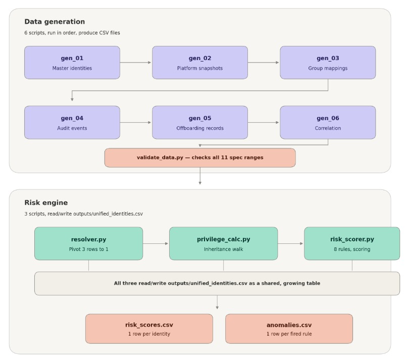
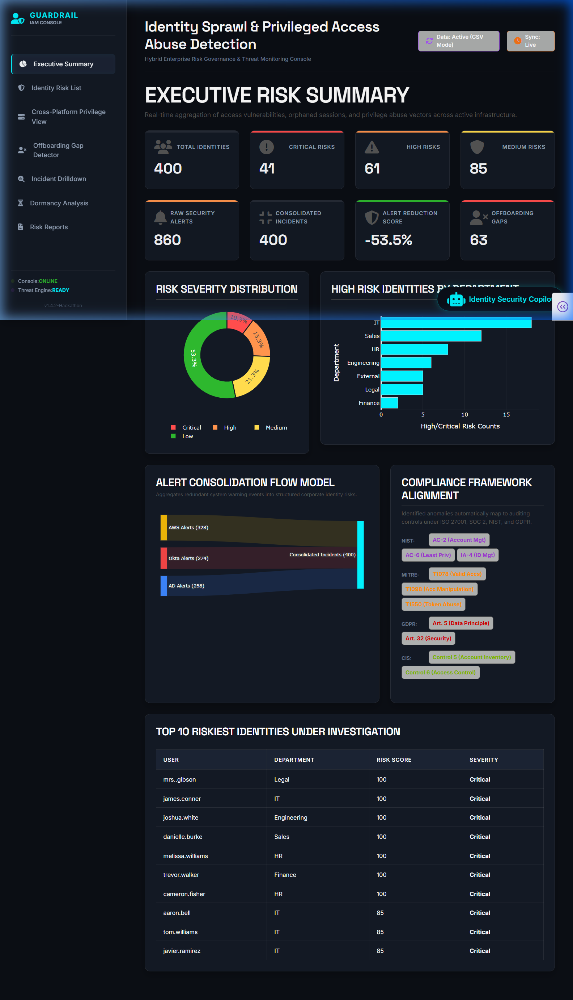
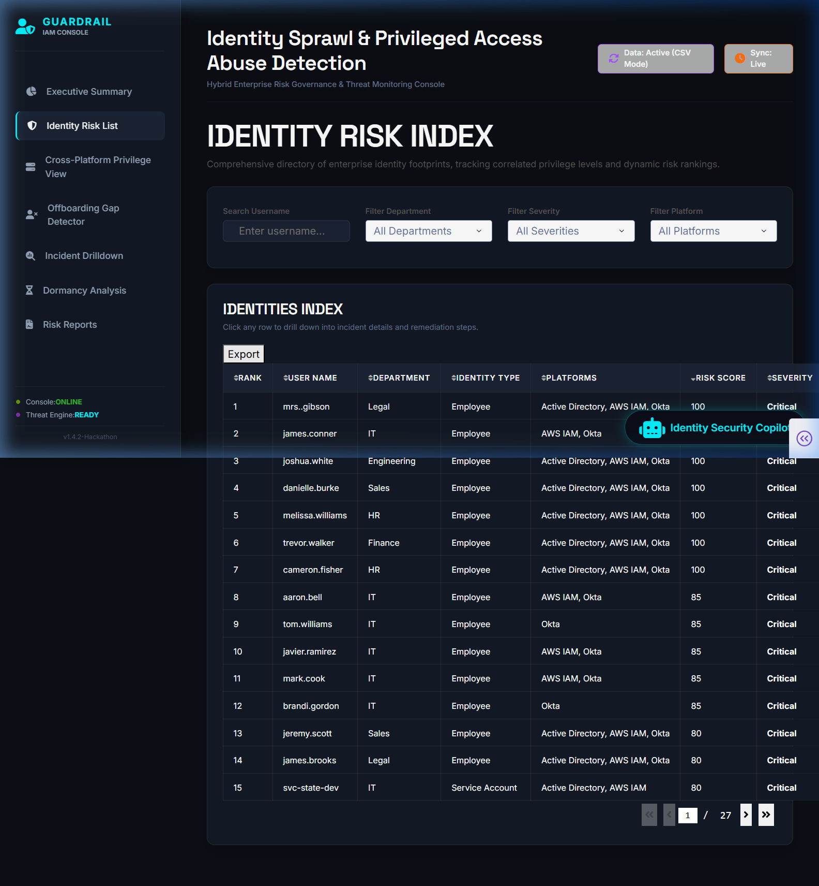
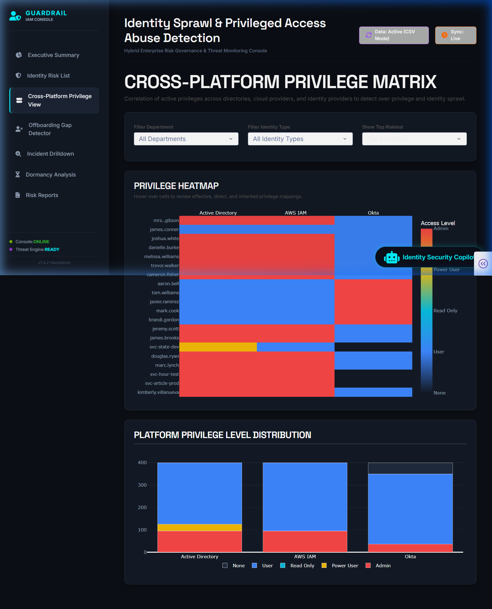
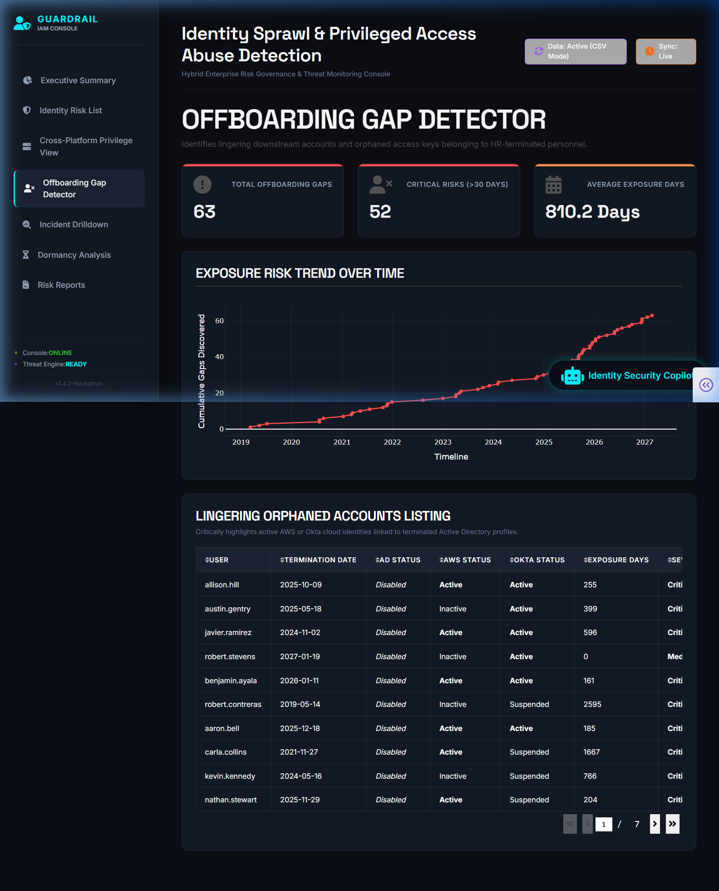
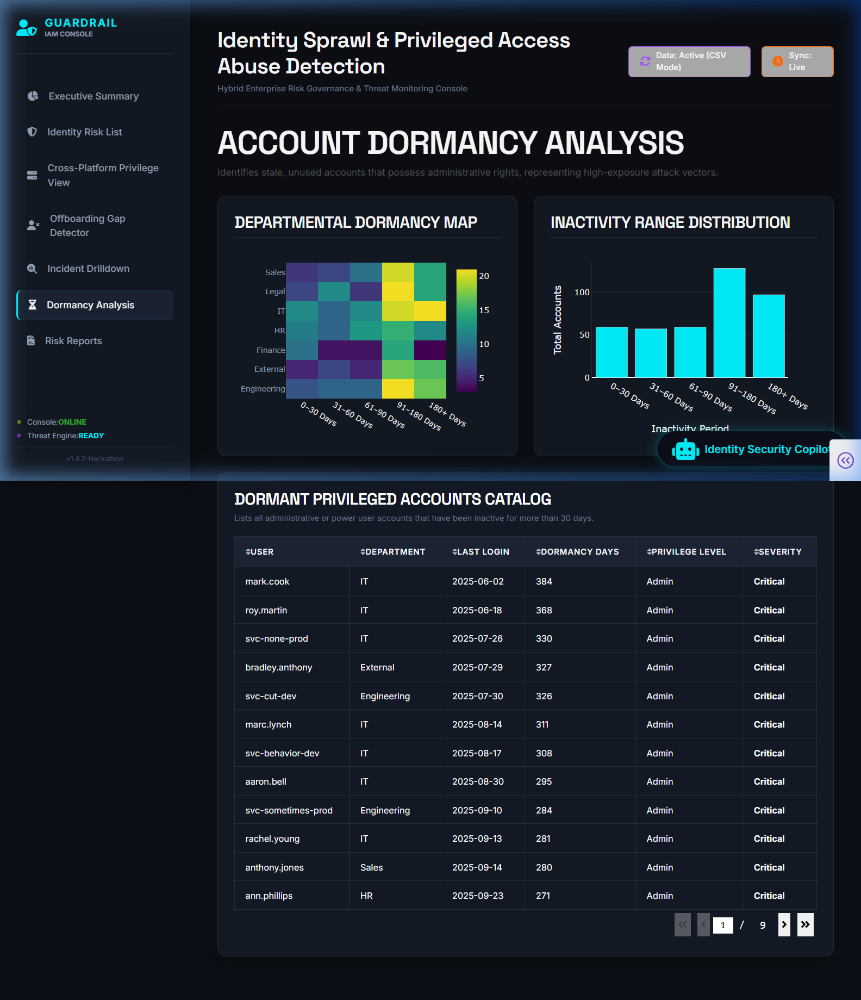

# 🛡️ Guardrail IAM Console
### Identity Sprawl & Privileged Access Abuse Detection Engine for Hybrid Enterprises


> *"When a service account is granted Domain Admin in AD and simultaneously given S3 full-access in AWS, the risk is invisible to both teams."* — Problem Statement

Guardrail is our answer to that problem. A full-stack identity risk platform that correlates identities across Active Directory, AWS IAM, and Okta — computing effective privilege through nested group inheritance, scoring risk with an explainable rule engine aligned to MITRE ATT&CK, and surfacing findings through an analyst-grade investigation console with an AI-powered Security Copilot.

---

## ⚡ What Makes This Different

Most identity tools flag individual platform anomalies. Guardrail finds the risks that only appear when you look across all three platforms simultaneously.

- **Nested group inheritance traversal** — detects "hidden admins" whose direct assignment looks standard but whose effective privilege is Domain Admin through 2–3 levels of group nesting. 28 such cases detected in our dataset.
- **Cross-platform unjustified admin detection** — flags identities with admin on 2+ platforms with no recorded business justification, distinct from legitimately privileged users. Exactly 40 flagged vs 95 total cross-platform admins — the distinction between signal and noise.
- **Independent platform offboarding gaps** — each platform's disable status tracked separately, catching the real-world pattern where AD is disabled but Okta/AWS remain active.
- **Explainable scoring, not a black box** — every risk score decomposes into named rules, each citing a MITRE ATT&CK technique, a NIST SP 800-53 control, and a platform-specific remediation command.
- **AI Security Copilot** — powered by Claude, with real backend context injected per query, generating incident narratives, audit notes, and remediation runbooks on demand.

---
## ⚙️ System Architecture & Data Flow

The project consists of a multi-stage Python data generation/analysis pipeline and a Dash dashboard visualizer. Below is the system flow depicting the pipeline steps and the risk engine correlation process.



---

## 📁 Repository Structure

The project is split into two primary components: the data pipeline (backend) and the visual console (frontend).

```
SG_Hackathon/
├── Identity_sprawl_project/       # Backend Risk Analysis Pipeline
│   └── Identity_sprawl_project/
│       └── identity_sprawl/
│           ├── engine/            # Privilege calculations & risk scoring engines
│           ├── data/              # Simulated platform snapshots & audit logs
│           ├── outputs/           # Processed correlation and anomaly outputs
│           ├── run_pipeline.py    # Main script to run the generation & analysis pipeline
│           └── requirements.txt   # Backend dependencies
│
└── Societe Generale/              # Frontend Dashboard & Analyst Console
    ├── app.py                     # Dash application entry point
    ├── pages/                     # Console page layouts & callback logic
    │   ├── executive_summary.py
    │   ├── identity_risk_list.py
    │   ├── cross_platform_privilege.py
    │   ├── offboarding_detector.py
    │   ├── dormancy_analysis.py
    │   ├── incident_drilldown.py
    │   └── risk_reports.py
    ├── utils/                     # Data adaptation, LLM, and prompt utilities
    ├── assets/                    # Styling sheets & static assets
    └── requirements.txt           # Dashboard dependencies
```

---

## 🖥️ Console Screen Previews

Here is a look at the Guardrail IAM Console in action:

### 1. Executive Summary
Provides a high-level visual posture of global risks, active directory/cloud threats, and SOC system integrity status.


### 2. Identity Risk List
Searchable registry of all monitored enterprise identities, displaying threat severity, detected risks, and risk scores.


### 3. Cross-Platform Privilege View
Maps direct and inherited privilege paths to resolve effective permissions across Active Directory, Okta, and AWS IAM.


### 4. Offboarding Gap Detector
Identifies terminated employees with lingering active cloud platform sessions, calculating real-time security exposure windows.


### 5. Dormancy Analysis
Flags stale login tokens, inactive API keys, and dormant admin accounts requiring credential rotation or de-provisioning.


---

## 🌟 Key Features

1. **Executive Summary Dashboard**: Visualizes global risk postures, system health states, and critical threat counts across AD, Okta, and AWS IAM.
2. **Cross-Platform Privilege View**: Traces identity privileges from direct assignments to nested inheritance chains, mapping effective access.
3. **Offboarding Gap Detector**: Identifies terminated users with lingering active accounts, calculating cumulative security exposure days.
4. **Dormancy Analysis**: Flags high-privileged admin accounts and static API keys that have not authenticated recently.
5. **Incident Drilldown**: Generates structured audit trails with context and MITRE ATT&CK framework mapping for triggered alerts.
6. **Identity Security Copilot**: An LLM-powered AI chat assistant that drafts audit notes, recommends remediation plans, and summarizes active incidents for security analysts.

---

## 🚀 Getting Started

### Prerequisites
- Python 3.10 or higher
- Git

### 1. Run the Backend Pipeline (Optional)
To regenerate/re-correlate the simulated data:
```bash
# Navigate to the backend directory
cd "Identity_sprawl_project/Identity_sprawl_project/identity_sprawl"

# Install backend dependencies
pip install -r requirements.txt

# Run the data generation and analysis pipeline
python run_pipeline.py
```

### 2. Run the Dashboard Frontend
To start the Guardrail IAM visual console:
```bash
# Navigate to the frontend directory
cd "Societe Generale"

# Install frontend dependencies
pip install -r requirements.txt

# Run the application
python app.py
```

Open [http://127.0.0.1:8050/](http://127.0.0.1:8050/) in your web browser to view the console.

---

## 🛡️ Security & Compliance
This console helps security teams ensure compliance with key security controls:
* **CIS Controls**: Access Control Management, Account Monitoring.
* **ISO 27001**: Annex A.9 (Access Control).
* **SOX / SOC 2**: Privilege access reviews and user termination verification.

